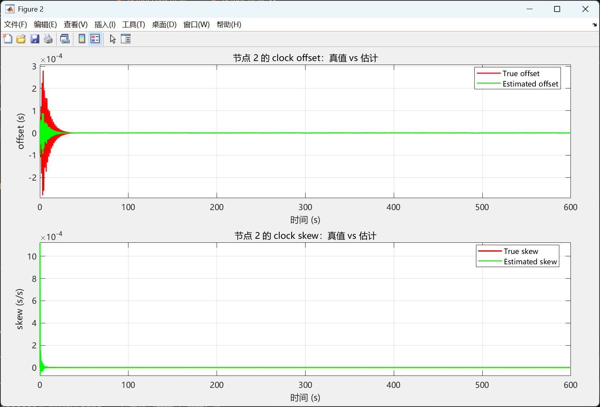
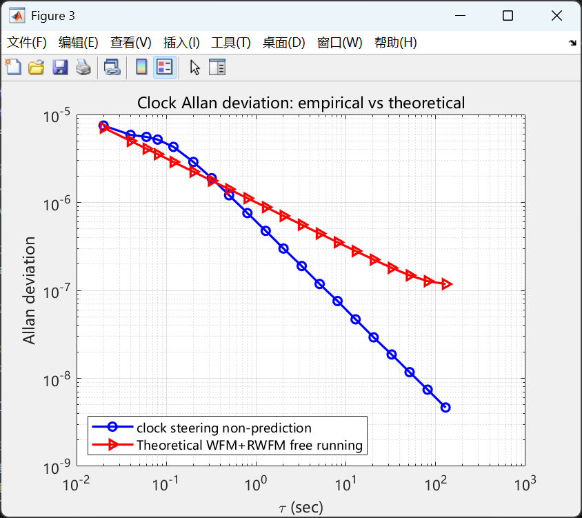

# section 1

## demo2_test1
 

parameter setting
T_end   = 600;                % 仿真总时间 (s)
q1 = 1e-16;                    % WFM
q2 = 1.44e-18;                %  RWFM
p_idx = 1;
v_idx = 1;

parameter setting
T_end   = 600;                % 仿真总时间 (s)
q1 = 1e-12;                    % WFM
q2 = 1.44e-16;                %  RWFM
p_idx = 1;
v_idx = 1;

